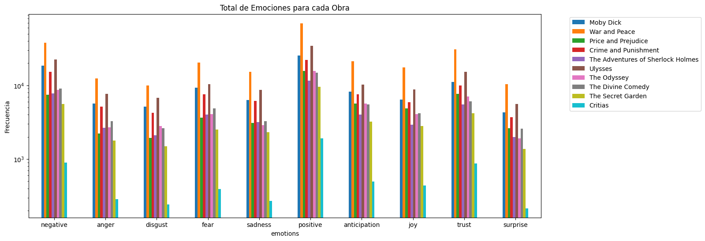
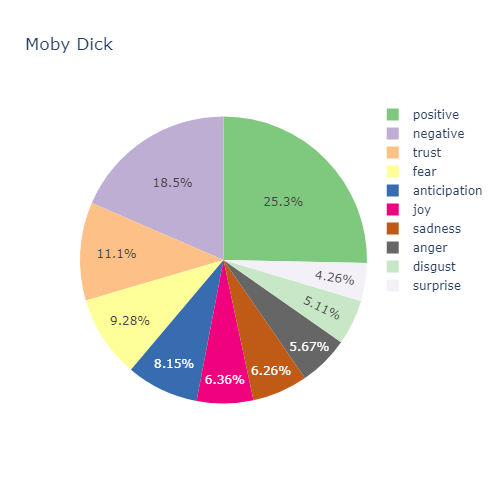

# Analysis of Emotions in Classic Novels
This project uses Natural Language Processing (NLP) to examine the emotions conveyed in literary texts from Project Gutenberg. The aim is to develop a system capable of identifying and quantifying the emotions within these texts. This task emphasizes the application of advanced NLP methods, such as sentiment analysis, text information extraction, and general natural language processing techniques.

## Resources

1. **Lexicon of Emotions**: This collection links words to emotions using the NRC Emotion Lexicon. It includes 14,182 words sorted into positive and negative sentiments, along with emotions like anger, joy, and trust, and is available in over a hundred languages via machine translation.

2. **WordNet**: This English lexical database groups words into sets of synonyms known as synsets. It can enhance the NRC lexicon by adding synonyms, hyponyms, and hypernyms to existing words, helping to capture a wider range of emotional expressions and improve sentiment analysis.

3. **Project Gutenberg**: This digital library provides thousands of free e-books and is a valuable resource for free literary texts, useful for both educational and research purposes.

4. **Beautiful Soup**: This Python library extracts data from HTML and XML files. It is used to download and clean text from Project Gutenberg, allowing for efficient extraction of text from HTML tags for sentiment analysis.

## Process

1. The NRC Emotion Lexicon was downloaded to serve as the foundation for the analysis.
2. The lexicon was enhanced using WordNet, a comprehensive lexical database. This process involved adding synonyms, hypernyms (broader terms), hyponyms (narrower terms), and derived words, each annotated with their respective part-of-speech (POS) tags and associated emotions.
3. Classical novels from the Gutenberg Project were downloaded to serve as the corpus for the analysis. These texts were tokenized and normalized using BeautifulSoup, which included the removal of HTML tags and other extraneous elements. Stop words (common words with little semantic value) were also removed to focus on the meaningful content. Further, words were lemmatized to reduce them to their base forms, and POS tags were assigned to each word.
4. Finally, the frequency of occurrences of the various words was counted for each book. The associated emotions, as determined from the expanded lexicon, were also tallied to analyze the emotional content of the texts.

## Results

The results and the emotions associated with the various books are presented below. It is evident that positive emotions predominate in all the books, followed by negative emotions.

The emotions associated with Moby Dick are shown here.
